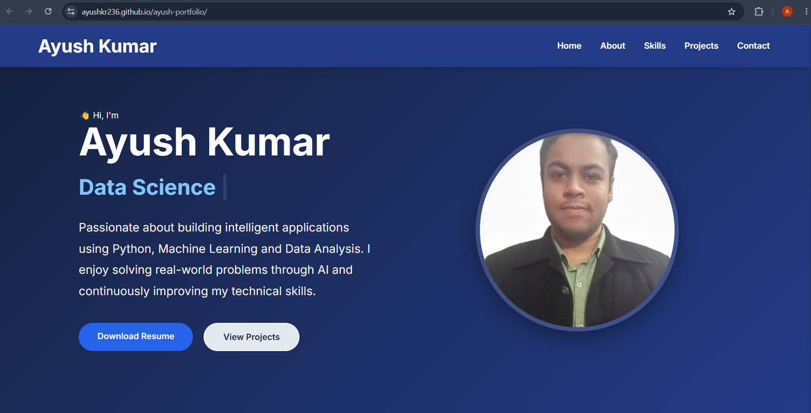

# 👋 Hi, I'm Ayush Kumar
## 📸 Portfolio Preview



<h3 align="center">
Python Developer • Machine Learning Enthusiast • Data Science
</h3>

<p align="center">

<a href="https://ayushkr236.github.io/ayush-portfolio/">🌐 Live Portfolio</a> •
<a href="mailto:ayushkr2456@gmail.com">📧 Email</a> •
<a href="https://www.linkedin.com/in/ayush-kumar-0946aa281">💼 LinkedIn</a>

</p>

---

# 🚀 About This Project

This repository contains the source code for my personal portfolio website built using HTML, CSS, and JavaScript.

The portfolio showcases my skills, certifications, education, projects, and contact information as I pursue a career in Python Development, Machine Learning, and Data Science.

---

# 🌐 Live Website

### 👉 https://ayushkr236.github.io/ayush-portfolio/

---

# 🛠 Tech Stack

### Frontend


---

### Programming


---

### Machine Learning


---

### Data Science


---

### Tools


---

# ✨ Features

- Responsive Design
- Modern UI
- Download Resume
- Project Showcase
- Certificates Section
- Contact Information
- Mobile Friendly
- Smooth Navigation

---

# ❤️ Featured Project

## Heart Disease Prediction System

A Machine Learning project that predicts the likelihood of heart disease using patient medical data.

### Highlights

- Data Cleaning
- Data Preprocessing
- Machine Learning Model
- Prediction System
- Performance Evaluation

---

# 📂 Project Structure

```text
ayush-portfolio/
│
├── assets/
│   ├── certificates/
│   ├── images/
│   └── resume/
│
├── index.html
├── style.css
├── script.js
└── README.md
```

---

# 👨‍💻 About Me

I am a B.Tech Computer Science graduate passionate about Python Development, Machine Learning, and Data Science.

I enjoy solving real-world problems through intelligent applications while continuously learning new technologies and improving my development skills.

---

# 📜 Certifications

- Python Training
- Machine Learning Training (DUCAT)
- C Programming
- B.Tech Summer Internship

---

# 📫 Contact

📧 **Email**

ayushkr2456@gmail.com

💼 **LinkedIn**

https://www.linkedin.com/in/ayush-kumar-0946aa281

💻 **GitHub**

https://github.com/Ayushkr236

---

# ⭐ If you like this project

Please consider giving this repository a ⭐.

It helps support my work and motivates me to build more projects.
